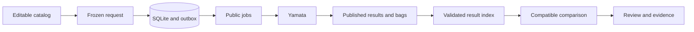

# Code tour

Start with `make demo` in the [README](../README.md#run-the-standalone-demo).
Open the stopped-obstacle result and its cited recording tick.
Then follow the same data through the boundaries below.

## Follow one test

Copernicus owns selection, admission, dispatch records, imports, and review.
Yamata owns simulation, recordings, and scoring.
Each program owns its database. Their commands exchange public files.
The standalone demo copies reviewed files instead of starting Yamata.

## Design claims and evidence

Each row links a behavior to its implementation and a test that can reject an incorrect change.
Tests use synthetic inputs and temporary state.

| Behavior | Implementation | Verification |
| --- | --- | --- |
| Help has no storage side effects. Command errors produce failure exits. | [Command boundary](../cmd/copernicus/main.go) | [Command tests](../cmd/copernicus/main_test.go) |
| Catalog imports reject ambiguous JSON and broken references atomically. | [Validation](../internal/catalog/json.go), [catalog store](../internal/store/catalog.go) | [Input tests](../internal/catalog/catalog_test.go), [store tests](../internal/store/catalog_test.go) |
| Collection expansion keeps each test's first occurrence. | [Expansion](../internal/catalog/expand.go) | [Expansion tests](../internal/store/catalog_test.go) |
| Requests freeze complete inputs. Later suite edits cannot change them. | [Resolver](../internal/request/resolve.go), [request store](../internal/store/requests.go) | [Snapshot tests](../internal/store/requests_test.go) |
| Identical request retries return one snapshot and one reservation. | [Admission](../internal/store/budgets.go) | [Budget tests](../internal/store/budgets_test.go) |
| Requests, compatible jobs, and budget reservations commit together. | [Request transaction](../internal/store/requests.go) | [Rollback tests](../internal/store/requests_test.go), [admission tests](../internal/store/budgets_test.go) |
| The adapter uses only frozen inputs and the pinned public contract. | [Job adapter](../internal/adapter/jobs.go), [source record](../compatibility/yamata.json) | [Adapter tests](../internal/adapter/jobs_test.go), [contract tests](../compatibility/contract_test.go) |
| Publication survives process exit without replacing accepted bytes. | [Outbox](../internal/store/outbox.go), [publisher](../internal/exchange/publish.go) | [Process recovery tests](../internal/store/outbox_test.go) |
| Imports validate exact job ownership, result hashes, and recordings. | [Outcome validation](../compatibility/outcomes.go), [importer](../internal/store/results.go) | [Import tests](../internal/store/results_test.go) |
| Replay and index rebuild keep accepted request state. | [Result store](../internal/store/results.go) | [Recovery tests](../internal/store/results_test.go) |
| Missing evidence becomes incomplete and cannot supply a passing score. | [Progress](../internal/store/progress.go), [review](../internal/store/review.go) | [Progress tests](../internal/store/results_test.go), [review tests](../internal/store/review_test.go) |
| Pairing excludes controller differences and rejects incompatible scoring content. | [Comparison plan](../internal/comparison/model.go) | [Comparison tests](../internal/comparison/comparison_test.go) |
| DuckDB reads private copies of validated results with bounded resources. | [Query process](../internal/comparison/duckdb.go), [SQL](../internal/comparison/deltas.sql) | [Query tests](../internal/comparison/comparison_test.go) |
| Filters and pages keep complete denominators. | [View selection](../internal/comparison/view.go) | [View tests](../internal/comparison/view_test.go) |
| Only complete selections reuse saved pages, after fresh evidence checks. | [Saved comparisons](../internal/store/saved_comparisons.go) | [Cache tests](../internal/store/saved_comparisons_test.go) |
| New scores keep original recordings, snapshots, and results. | [Analysis selections](../internal/store/analysis.go), [analysis adapter](../internal/adapter/analysis.go) | [Analysis tests](../internal/store/analysis_test.go), [browser tests](../web/e2e/review.spec.ts) |
| HTTP access stays on loopback and rejects foreign browser origins. | [Server](../cmd/copernicus/serve.go), [HTTP boundary](../internal/httpapi/review.go) | [HTTP tests](../internal/httpapi/review_test.go) |
| Browser drafts survive failures. Links keep explicit review selections. | [Request form](../web/src/CreateRequest.tsx), [comparison view](../web/src/Comparison.tsx) | [Browser acceptance](../web/e2e/review.spec.ts) |
| Evidence views show only ticks cited by the selected result. | [Review reads](../internal/store/review.go), [evidence view](../web/src/Execution.tsx) | [Review tests](../internal/store/review_test.go), [browser acceptance](../web/e2e/review.spec.ts) |
| The combined demo builds the recorded revision without editing its source checkout. | [Engine build](../scripts/walkthrough.py) | [Public walkthrough checks](../tests/walkthrough.py) |
| Standalone results match fresh execution except duration and queue attempt identifiers. | [Reference manifest](../examples/reference/v1/manifest.json), [walkthrough](../scripts/walkthrough.py) | [Reference drift checks](../tests/walkthrough.py) |
| Demo creation refuses existing directories. Cleanup requires its original ownership marker. | [Demo lifecycle](../scripts/walkthrough.py) | [Cleanup rejection tests](../tests/walkthrough.py) |

## Read by responsibility

The command package parses arguments, creates dependencies, bounds operations, and reports failures.
Pure catalog, request, and comparison packages calculate values without starting services.
The store package owns SQLite transactions and joins saved state with validated public files.
The exchange package owns bounded file reads and durable publication.

The browser validates API responses in [api.ts](../web/src/api.ts).
[App.tsx](../web/src/App.tsx) maps URL selections to review views.
[styles.css](../web/src/styles.css) owns shared colors, spacing, focus, and responsive layouts.
[Browser acceptance tests](../web/e2e/review.spec.ts) check keyboard access, missing data, and narrow layouts.

The [Makefile](../Makefile) separates build, demo, verification, and cleanup commands.
The [walkthrough tests](../tests/walkthrough.py) use public CLI and HTTP boundaries without direct database writes.
The [reference guide](../examples/reference/README.md) explains provenance and regeneration.
The [troubleshooting guide](troubleshooting.md) explains recovery without editing accepted identities.

## Continue with a topic

- [Test model](test-model.md): catalog records and selection order.
- [Requests](requests.md): frozen inputs and submission identity.
- [Exchange](exchange.md): durable publication and restart.
- [Lifecycle](lifecycle.md): import, progress, and index recovery.
- [Comparisons](comparisons.md): pairing, deltas, and denominators.
- [Review](review-guide.md): browser actions and evidence.
- [Reanalysis](reanalysis.md): kept recordings and explicit scoring versions.
- [Decisions](decisions.md): admission budgets and saved comparison identity.
