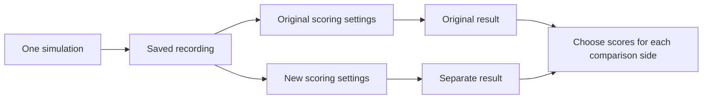

# Score saved recordings again

A recording preserves what happened during a test.
An analysis template defines how to score that recording.
Changing the scoring rules can change a measurement without changing the recorded motion.
Copernicus keeps the original scores and lets you select another saved analysis for review.



## Produce the original results

Prerequisites: the [README tools and installed dependencies](../README.md#build-and-read-the-command-help), Python 3, and DuckDB.
Place `yamata` on `PATH`, built from the revision in [the execution source record](../compatibility/yamata.json).
Use one shell and a dedicated temporary exchange.
From the Copernicus repository root, run:

```sh
make build
score_dir=$(mktemp -d)
mkdir "$score_dir/exchange"
./bin/copernicus catalog import --db "$score_dir/catalog.sqlite" --file examples/catalog.json
./bin/copernicus catalog import --db "$score_dir/catalog.sqlite" --file examples/reanalysis-catalog.json
./bin/copernicus request create --db "$score_dir/catalog.sqlite" --id score-baseline --collection all-tests --controller baseline --requester reviewer > "$score_dir/baseline.json"
./bin/copernicus request create --db "$score_dir/catalog.sqlite" --id score-candidate --collection all-tests --controller candidate --requester reviewer > "$score_dir/candidate.json"
./bin/copernicus outbox publish --db "$score_dir/catalog.sqlite" --exchange-dir "$score_dir/exchange"
for job in "$score_dir"/exchange/jobs/*.json
do
  yamata enqueue --exchange-dir "$score_dir/exchange" "jobs/${job##*/}"
done
yamata workers --exchange-dir "$score_dir/exchange" --drain
./bin/copernicus results import --db "$score_dir/catalog.sqlite" --exchange-dir "$score_dir/exchange"
cp -R "$score_dir/exchange/bags" "$score_dir/original-bags"
cp -R "$score_dir/exchange/results" "$score_dir/original-results"
cp -R "$score_dir/exchange/events" "$score_dir/original-events"
yamata queue --exchange-dir "$score_dir/exchange" > "$score_dir/queue-before.json"
./bin/copernicus request status --db "$score_dir/catalog.sqlite" --id score-candidate > "$score_dir/original-progress.json"
```

Expect successful commands, six recordings, and six original results.
Each request contains three tests.
`edge-v2` changes the minimum obstacle gap measurement to body-edge clearance.
The original `standard-v1` template measures center distance.
Other metric versions and limits stay unchanged.

## Request the candidate's new scores

Prerequisites: the completed original results and the same shell variables.
From the repository root, run:

```sh
./bin/copernicus analysis create --db "$score_dir/catalog.sqlite" --request score-candidate --template edge-v2 > "$score_dir/selection.json"
./bin/copernicus analysis list --db "$score_dir/catalog.sqlite" --request score-candidate
./bin/copernicus analysis status --db "$score_dir/catalog.sqlite" --request score-candidate --analysis edge-v2
./bin/copernicus outbox publish --db "$score_dir/catalog.sqlite" --exchange-dir "$score_dir/exchange"
for job in "$score_dir"/exchange/jobs/*.json
do
  yamata enqueue --exchange-dir "$score_dir/exchange" "jobs/${job##*/}"
done
yamata workers --exchange-dir "$score_dir/exchange" --simulation-workers 0 --analysis-workers 1 --drain
./bin/copernicus results import --db "$score_dir/catalog.sqlite" --exchange-dir "$score_dir/exchange"
./bin/copernicus compare --db "$score_dir/catalog.sqlite" --baseline score-baseline --candidate score-candidate --baseline-analysis original --candidate-analysis edge-v2 > "$score_dir/mismatched.json"
```

Creation prints an immutable selection with its template and execution-to-job mapping.
The list includes `original` and `edge-v2`.
Before processing, the new selection has zero completed tests; the original selection retains three.
The worker command disables simulation and processes only analysis work.
Repeated deliveries of original jobs return duplicate receipts.

The comparison reports three `INCOMPARABLE` groups because the selected scoring configurations differ.
It produces no metric deltas for those groups.
A successful command means the comparison was read; it does not mean the scores were compatible.

## Match the baseline and verify preservation

Prerequisites: the candidate's new scores and the same shell variables.
From the repository root, run:

```sh
./bin/copernicus analysis create --db "$score_dir/catalog.sqlite" --request score-baseline --template edge-v2
./bin/copernicus outbox publish --db "$score_dir/catalog.sqlite" --exchange-dir "$score_dir/exchange"
for job in "$score_dir"/exchange/jobs/*.json
do
  yamata enqueue --exchange-dir "$score_dir/exchange" "jobs/${job##*/}"
done
yamata workers --exchange-dir "$score_dir/exchange" --simulation-workers 0 --analysis-workers 1 --drain
./bin/copernicus results import --db "$score_dir/catalog.sqlite" --exchange-dir "$score_dir/exchange"
./bin/copernicus compare --db "$score_dir/catalog.sqlite" --baseline score-baseline --candidate score-candidate --baseline-analysis edge-v2 --candidate-analysis edge-v2 > "$score_dir/matched.json"
yamata queue --exchange-dir "$score_dir/exchange" > "$score_dir/queue-after.json"
./bin/copernicus request show --db "$score_dir/catalog.sqlite" --id score-candidate > "$score_dir/candidate-after.json"
./bin/copernicus request status --db "$score_dir/catalog.sqlite" --id score-candidate > "$score_dir/progress-after.json"
cmp "$score_dir/candidate.json" "$score_dir/candidate-after.json"
cmp "$score_dir/original-progress.json" "$score_dir/progress-after.json"
diff -r "$score_dir/original-bags" "$score_dir/exchange/bags"
python3 - "$score_dir" <<'PY'
import hashlib
import json
from pathlib import Path
import sys

root = Path(sys.argv[1])
exchange = root / "exchange"
for folder in ("results", "events"):
    for before in (root / ("original-" + folder)).glob("*.json"):
        assert before.read_bytes() == (exchange / folder / before.name).read_bytes()
results = [json.loads(p.read_text()) for p in (exchange / "results").glob("*.json")]
assert len(results) == 12
assert len(list((exchange / "bags").glob("*.jsonl"))) == 6
for first in results:
    if first["metrics"]["minimum_obstacle_gap"]["version"] != 1:
        continue
    second = next(r for r in results if r["execution_id"] == first["execution_id"]
                  and r["metrics"]["minimum_obstacle_gap"]["version"] == 2)
    assert first["analysis_id"] != second["analysis_id"]
    assert first["bag"] == second["bag"]
    bag = first["bag"]
    assert hashlib.sha256((exchange / bag["path"]).read_bytes()).hexdigest() == bag["sha256"]
    assert first["metrics"]["collision_count"] == second["metrics"]["collision_count"]
    assert first["metrics"]["goal_progress"] == second["metrics"]["goal_progress"]
before = json.loads((root / "queue-before.json").read_text())
after = json.loads((root / "queue-after.json").read_text())
assert before["dispatch_positions"]["simulation"] == after["dispatch_positions"]["simulation"] == 6
assert json.loads((root / "mismatched.json").read_text())["counts"]["incomparable"] == 3
assert json.loads((root / "matched.json").read_text())["counts"]["compared"] == 3
print("Six unchanged recordings; twelve results; six simulation dispatches; comparison restored.")
PY
./bin/copernicus analysis create --db "$score_dir/catalog.sqlite" --request score-candidate --template edge-v2 > "$score_dir/retry.json"
cmp "$score_dir/selection.json" "$score_dir/retry.json"
```

Expect successful byte comparisons and the printed verification message.
Matching scoring configurations restore three compared groups.
The `stopped-obstacle` candidate has gap values of `3400 mm` originally and `0 mm` under `edge-v2`.
Its collision count remains `1`, with evidence at tick `22`.
Its goal progress remains `360000 ppm`.
The aggregate result remains `FAIL`.

## Choose scores in the browser

Prerequisites: the completed commands above, a modern browser, and an available port `8080`.
From the same shell and repository root, run:

```sh
./bin/copernicus serve --db "$score_dir/catalog.sqlite" --web-dir web/dist --port 8080 > "$score_dir/server.log" 2>&1 &
score_pid=$!
```

Expect `Review interface: http://127.0.0.1:8080` in the log.
Open [the local interface](http://127.0.0.1:8080/).

1. Open `score-candidate`.
2. Choose `edge-v2` under **Scores to review**.
3. Open **Score these recordings again** to request another available template.
4. Select **Compare** and choose both saved requests.
5. Set **Baseline scores** and **Candidate scores** independently.
6. Select **Compare requests**.
7. Open **Candidate: stopped-obstacle**, then its collision evidence at **Tick 22**.

Selecting `original` and `edge-v2` produces incompatible groups.
Selecting `edge-v2` on both sides restores comparisons.
**Selected score limits** shows the chosen template; **Original score limits** retains the initial configuration.
Review links, evidence links, and comparison pagination preserve both analysis selections.
Browser requests queue analysis jobs; repeat the publication, worker, and import commands to process new selections.

## Selection and recovery rules

The reserved `original` selection uses each test's initial scoring template.
Other selections use a catalog template ID and freeze its complete configuration for every original execution.
A request can contain different original templates; one new selection applies the chosen template across all its tests.
Comparison pairing retains each test's original logical analysis name.
Compatibility then checks the selected template content, metric versions, and units.

Creation requires validated original results and recordings for every selected test.
Missing recordings, incomplete executions, and resolution failures reject the whole selection without saving partial jobs.
A terminal error can be rescored when its validated result includes a recording.
Unsupported scoring settings are rejected before publication.
All later reads revalidate files; missing evidence becomes incomplete without selecting another result.

Retries return the accepted immutable mapping, even if a recording later becomes unavailable.
Equivalent template content reuses existing jobs, including original jobs when the configuration is unchanged.
Catalog labels alone cannot create duplicate public analysis identities.
Unknown selection IDs fail explicitly; there is no automatic newest-result selection.

Yamata needs the original accepted run in the same queue to recover geometry omitted from bag format one.
Keep the exchange and its queue together.
Copied recordings in a fresh queue lack that context.
Copernicus reads public files and uses public commands; it does not open the execution engine's database.

[Database schema five](../internal/store/analysis-v5.sql) preserves existing requests, result references, and outgoing job bytes during upgrade.
It permits multiple analysis jobs per execution while retaining one original run job.
Saved selections are immutable; the [result index](lifecycle.md#rebuild-the-result-index) remains derived and rebuildable.

## Stop and clean up

Prerequisites: the same shell variables and completed review.
From the repository root, run:

```sh
kill "$score_pid"
wait "$score_pid"
rm -r "$score_dir"
unset score_pid score_dir
make clean
```

Expect graceful shutdown and exit code `0`.
Cleanup removes this walkthrough's exchange, database, logs, and generated builds.
Source files and installed dependencies remain available.
