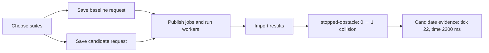

# Review a change in the browser

Use this guide to compare two braking rules against the same synthetic tests.
The browser saves requests, follows imported progress, and opens the inputs and recording ticks behind each result.



## Start the review server

Prerequisites: the [README tools and installed dependencies](../README.md#build-and-read-the-command-help), a modern browser, and an available port `8080`.
Install DuckDB using the [comparison setup](comparisons.md#install-the-query-tool).
For execution, place `yamata` on `PATH`, built from the revision in [the source record](../compatibility/yamata.json).
Use one shell and a dedicated exchange.
From the Copernicus repository root, run:

```sh
make build
review_dir=$(mktemp -d)
mkdir "$review_dir/exchange"
./bin/copernicus catalog import --db "$review_dir/catalog.sqlite" --file examples/catalog.json
./bin/copernicus serve --db "$review_dir/catalog.sqlite" --web-dir web/dist --port 8080 > "$review_dir/server.log" 2>&1 &
review_pid=$!
```

Expect successful commands and `Review interface: http://127.0.0.1:8080` in the log.
Open [the local review interface](http://127.0.0.1:8080/).
The first page shows an empty request list and **Create request**.
An occupied port causes startup failure.
Use the printed address, including its numeric host and port.

The `--web-dir` option enables request and analysis creation and opens the local database for writes.
Without that option, `serve` retains its read-only API mode.
Both modes reject foreign browser origins and unexpected hostnames.
The interface uses local assets and makes no external requests.

## Save the two requests

1. Select **Create request**.
2. Enter `baseline-review` as the request name.
3. Choose collection `all-tests`.
4. Select both `smoke` and `obstacles`.
5. Choose braking rule `baseline`.
6. Select **Create request**.

Expect the saved request page with zero of three tests completed.
Shared suite members produce only one test execution.
The page includes every selected test, including unresolved or incomplete tests.
Suite selection affects this request; it does not edit the catalog.

Select **Create another request**.
Repeat the steps with name `candidate-review` and braking rule `candidate`.
Keep the same suites and default seed.
Expect another saved request with three incomplete tests.

Drafts survive reloads and navigation within the same browser tab.
A failed submission preserves your entries.
Retrying the same name and inputs returns the saved request without duplicating jobs.
Different inputs require a new request name.

## Run the queued tests

Prerequisites: both browser-created requests, the same shell variables, and the pinned `yamata` executable on `PATH`.
From the repository root, run:

```sh
./bin/copernicus outbox publish --db "$review_dir/catalog.sqlite" --exchange-dir "$review_dir/exchange"
for job in "$review_dir"/exchange/jobs/*.json
do
  yamata enqueue --exchange-dir "$review_dir/exchange" "jobs/${job##*/}"
done
yamata workers --exchange-dir "$review_dir/exchange" --drain
./bin/copernicus results import --db "$review_dir/catalog.sqlite" --exchange-dir "$review_dir/exchange"
```

Expect exit code `0` from each command.
The open request page updates after import, showing three of three completed tests.
Completion includes failed tests, warnings, and execution errors; it does not mean every test passed.
The browser checks for updates every five seconds while visible.
Publication, workers, and result import remain separate command-line operations.

## Compare and inspect evidence

1. Select **Compare** in the main navigation.
2. Choose baseline request `baseline-review` and candidate request `candidate-review`.
3. Select **Compare requests**.
4. Find `stopped-obstacle` in the comparison table.

Expect three compared groups.
For `stopped-obstacle`, collision count changes from `0` to `1`.
Its delta is `+1`, labeled **regression**.
Other scores can improve or fail independently.

Select **Candidate: stopped-obstacle**.
Open a **Tick** link in the collision-count row.
The evidence section shows the cited recording tick and its time in milliseconds.
Expand **Scenario**, **Braking rule**, or **Original score limits** to inspect the saved inputs.
**Result identity** exposes the selected result and recording hashes.

Select **Back to comparison** to restore the selected requests, scoring configurations, and page.
The address preserves the selected request, execution, comparison page, and evidence tick.
Reloading a review link opens that same selection.
Comparison counts always cover all groups, including groups on other pages.

## Incomplete and unavailable results

An incomplete request remains comparable, but missing outcomes never become zero-valued scores.
Added, removed, incompatible, incomplete, and error groups stay visible.
Unavailable measurements retain their label.
The [comparison guide](comparisons.md#matching-and-row-types) explains each classification.

If a result or supporting recording changes or disappears, the next read removes its measured scores.
The test becomes incomplete, and cited evidence becomes unavailable.
Restore the original files, or repair the exchange and repeat result import as appropriate.
A failed read hides previously loaded values and offers **Retry**.

Use `Tab` and `Shift+Tab` to move between controls.
Use `Space` for suite checkboxes and `Enter` for links and buttons.
Scrollable tables can receive keyboard focus on narrow screens.
State labels use text as well as color.

## Verify the browser workflow

Prerequisites: installed dependencies, DuckDB, and the pinned Yamata executable.
From the repository root, install the test browser once:

```sh
cd web
npx playwright install chromium
cd ..
```

Expect exit code `0` and an installed Chromium test browser.
The browser remains in the Playwright cache for later runs.
Set `YAMATA_BIN` to the absolute path of your pinned Yamata executable.
From the repository root, run:

```sh
export YAMATA_BIN="$(command -v yamata)"
make check
make test-web
```

Expect successful Go, TypeScript, formatting, and browser checks.
The browser tests cover real execution, suite selection, draft recovery, partial results, evidence, missing recordings, keyboard use, and accessibility.
They create temporary databases and exchanges, then remove them after stopping their servers.
Screenshots and failure output stay under ignored `web/test-results/`.
Missing `YAMATA_BIN` fails the real-execution test; it never substitutes invented results.

## Stop and clean up

Prerequisites: the same shell variables and completed review.
From the repository root, run:

```sh
kill "$review_pid"
wait "$review_pid"
rm -r "$review_dir"
unset review_pid review_dir
make clean
```

Expect graceful shutdown and exit code `0`.
Cleanup removes this walkthrough's database, exchange, logs, and generated builds.
It preserves source files and installed dependencies.
To remove test output, run `rm -rf web/test-results web/playwright-report` from the repository root.

Follow the [reanalysis guide](reanalysis.md) to request new scores and choose saved analyses independently on each comparison side.
