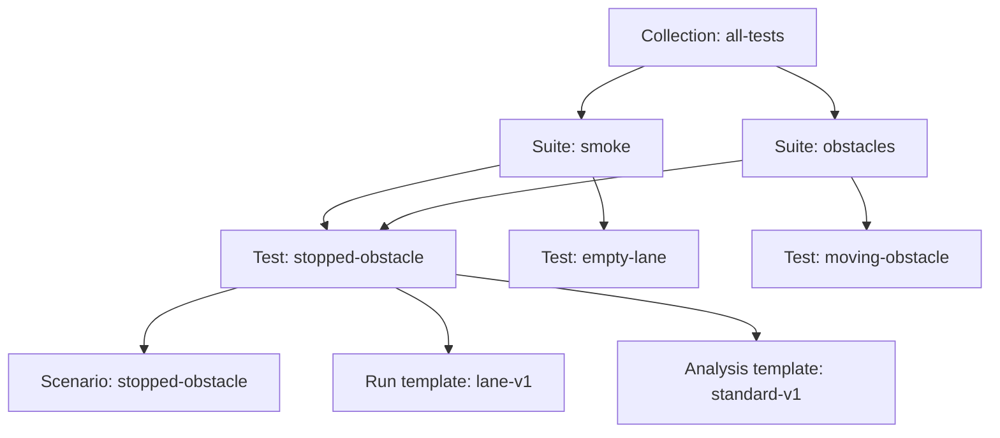

# Test definitions and the local catalog

A test combines a scenario, a run template, and an analysis template.
A suite orders tests.
A collection orders suites.
The catalog stores these definitions before a reviewer creates a request.
The [request guide](requests.md) explains frozen inputs and later suite edits.



The [example catalog](../examples/catalog.json) contains the complete definitions.
Its scenarios describe an empty lane, a stopped obstacle, and a moving obstacle.
Its controller references identify `baseline` and `candidate`, each at version `1`.
A test does not select a controller; a later request will select one for its tests.

## Import and inspect the example

Prerequisites: the [README tools](../README.md#build-and-read-the-command-help), downloaded Go modules, and an ordinary account.
No execution service, second checkout, or internet connection is required after dependency installation.
From the repository root, run:

```sh
make build-cli
catalog_dir=$(mktemp -d)
./bin/copernicus catalog import --db "$catalog_dir/catalog.sqlite" --file examples/catalog.json
./bin/copernicus catalog show --db "$catalog_dir/catalog.sqlite"
./bin/copernicus catalog expand --db "$catalog_dir/catalog.sqlite" --collection all-tests
```

Import prints `Catalog imported.` after the transaction commits.
Show prints all stored definitions as JSON, sorted by identifier within each section.
Membership arrays retain their declared order.
Expand prints three test objects, ordered as `stopped-obstacle`, `empty-lane`, and `moving-obstacle`.
Each object retains its scenario, run-template, and analysis-template references.

The shared `stopped-obstacle` test appears once, at its first occurrence.
Expansion visits suites in collection order, then tests in suite order.
It does not sort tests by name.
An empty collection or an empty suite contributes no tests.
An unknown collection produces an error, rather than an empty result.

Run the same import command again:

```sh
./bin/copernicus catalog import --db "$catalog_dir/catalog.sqlite" --file examples/catalog.json
```

Expect exit code `1` and a duplicate-identifier error.
The original catalog remains intact, including its membership order.
Successful commands return exit code `0`.
Invalid arguments, invalid imports, storage failures, and output failures return exit code `1`.

From the same shell, clean up this example:

```sh
rm "$catalog_dir/catalog.sqlite"
rmdir "$catalog_dir"
unset catalog_dir
make clean
```

These commands remove the temporary catalog and generated builds.
They preserve source files and installed dependencies.
`make clean` alone never removes catalog databases.
Stop all commands using a catalog before removing its database.

## File format and validation

The import file contains one UTF-8 JSON object with `version` set to `1`.
The [model types](../internal/catalog/model.go) own the fields and value rules.
The example file shows every supported record type.
Omitted top-level sections mean no additions of that type.
Omitted numeric fields default to zero; validation still requires positive versions, lengths, and run limits.

| Section | Stored meaning |
| --- | --- |
| `scenarios` | Initial position, speed, goal, vehicle length, type, and obstacle geometry. |
| `controllers` | Named controller implementations and versions; no executable paths or commands. |
| `run_templates` | Accepted scenario type, simulator reference, tick duration, tick limit, and timeout. |
| `analysis_templates` | Metric versions and limits for collisions, obstacle gap, and goal progress. |
| `tests` | References to one scenario, one run template, and one analysis template. |
| `suites` | Ordered test identifiers. |
| `collections` | Ordered suite identifiers. |

Positions and lengths use millimeters; speeds use millimeters per second.
Durations use milliseconds.
Goal progress uses parts per million, from zero through one million.
Scenario positions and speeds must be nonnegative; the goal must follow the starting position.
An obstacle array is required, including an empty array when no obstacles exist.

Identifiers start with a lowercase letter and contain up to 64 lowercase letters, digits, underscores, or hyphens.
Each record type has its own identifier namespace.
Duplicate identifiers within a type are rejected, both inside a batch and against stored records.
Repeated members inside one suite or collection are also rejected.
Different suites may share a test.

Imports reject unknown fields, duplicate JSON keys, uppercase field aliases, null values, invalid numbers, and trailing JSON.
Input is limited to one mebibyte and 32 nesting levels.
The whole store permits 10,000 records and membership entries, with at most 16 mebibytes of definition content.
These bounds protect the local inspection commands from unbounded reads.

References may name existing records or records in the same import batch.
The database checks references inside the transaction.
A missing reference rejects the entire batch, including definitions inserted earlier in that transaction.
Imports add records; they do not replace existing definitions.
Use new identifiers for revised definitions in this version.
The [suite-edit command](requests.md#create-a-request-and-change-a-suite) can change an existing suite’s membership without replacing test definitions.

Catalog validation checks definition values and relationships.
It does not verify that an execution engine supports every named implementation or that a scenario matches a selected run template.
[Request resolution](requests.md#resolution-and-persistence) checks the pinned example before saving execution readiness.
The future execution adapter will also validate complete jobs before dispatch.
Importing or expanding a catalog never starts a simulation, creates a request, or calculates a score.

## Storage and failure behavior

The [SQLite schema](../internal/store/schema.sql) owns identifiers, foreign keys, and membership positions.
The [store](../internal/store/catalog.go) commits each import in one transaction.
Concurrent imports cannot accept the same identifier twice.
A process exit before commit leaves no accepted partial batch.

The database parent directory must already exist.
New database files use owner-only permissions.
Commands reject database and import-file symbolic links and nonregular files.
Use a directory controlled by your account; concurrent replacement of directory entries is outside this local tool's scope.
The database path is treated as a filesystem path, including spaces and URI punctuation.

Inspection opens SQLite in read-only mode and does not initialize a missing database.
An unrelated database or an unknown schema version is rejected.
A failed first import can leave an initialized database with no accepted records.
SQLite may use an adjacent rollback journal while a write is active.
The command waits up to three seconds for a database lock and has a 30-second operation deadline.

If confirmation output fails after commit, the error explicitly says the catalog was committed.
Use `catalog show` to inspect the stored outcome before retrying.
A repeated import cannot overwrite accepted records.
After an interrupted write, a writable import connection lets SQLite recover its journal before continuing.
No background worker, automatic retry loop, or external service is involved.

## Read the implementation

[Validation and JSON tests](../internal/catalog/catalog_test.go) cover malformed input and duplicate identifiers.
[Catalog store tests](../internal/store/catalog_test.go) cover persistence, ordering, rollback, concurrency, and process exit.
[Command tests](../cmd/copernicus/catalog_test.go) cover help, argument errors, imports, inspection, expansion, and failed confirmation output.
The [expansion function](../internal/catalog/expand.go) contains only collection traversal and first-occurrence selection.
